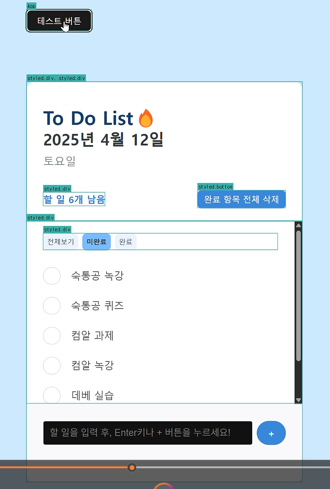
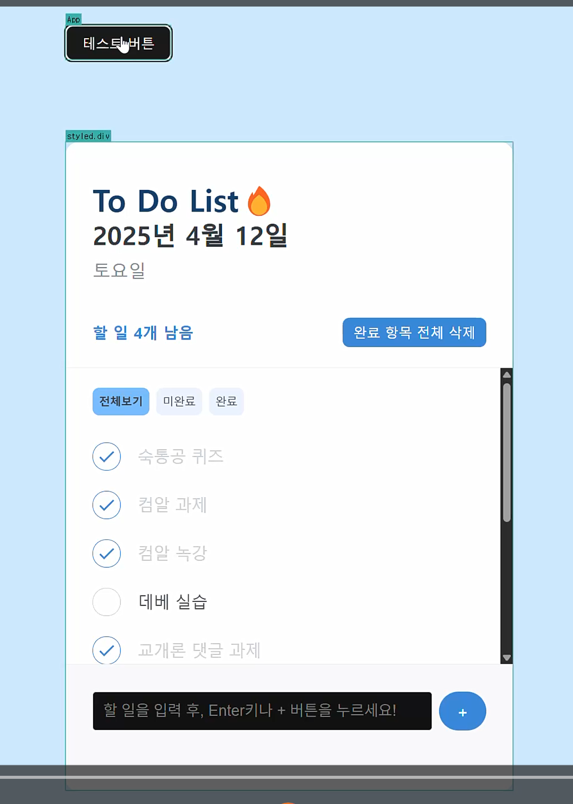
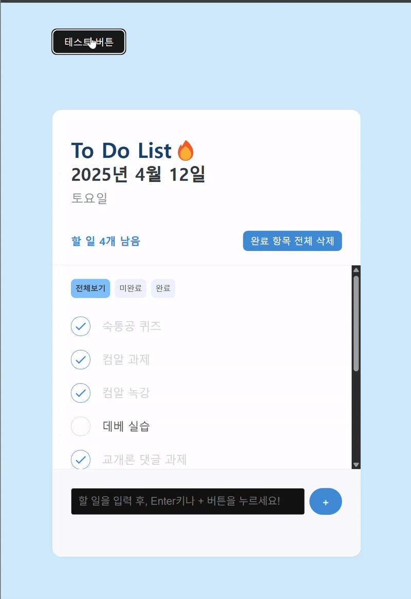

## 성능 개선 전

.gif>)

## 성능 개선 후

## useMemo

- App.jsx의 filteredTodos 함수: todos와 todofilter의 상태가 바뀌면(버튼 클릭 되면 상태 변경됨) 실행되도록 최적화했습니다.
- TodoHead.jsx의 today, dateString, dayName에 useMemo를 사용하여 날짜가 바뀔 때만 새로 계산하여 리렌더링 되도록 최적화했고, undoneTask에 useMemo를 사용하여 todo가 바뀔 때만 undoneTask의 길이(남은 할 일 개수)를 계산하도록 했습니다.

## useCallback

- TodoHead.jsx의 handleClearCompleted 함수에 useCallback을 적용하여 setTodo가 변경되었을때만 함수가 다시 생성되도록 했습니다.
- TodoItem.jsx의 onToggle, onRemove에 useCallback을 사용하여 각 아이템의 상태가 바뀌거나 삭제 될 때만 함수가 생성되도록 최적화했습니다.

## React.memo

- TodoCreate, TodoHead, TodoItem, TodoList 에서 React.memo를 사용하여 props가 바뀌지 않으면 리렌더링을 하지 않아 불필요한 리렌더링을 하지 않도록 하였습니다.
